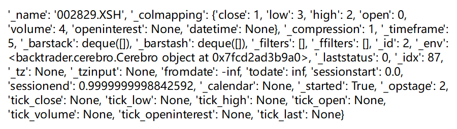

```
./app/
├── __pycache__ 每次运行自动生成,不用管,可删
│   └── main.cpython-38.pyc 
├── main.py 主函数,程序入口
├── scripts 算法脚本文件
│   ├── 1.py 
│   ├── 2.py
│   ├── 28.py
│   ├── 31.py
│   ├── 32.py
│   ├── 33.py
│   ├── 34.py
│   ├── test.py
│   └── utils 其他算法脚本文件使用的通用工具函数文件夹
│       └── common.py 
└── utils
    ├── __pycache__ 每次运行自动生成,不用管,可删
    │   └── index.cpython-38.pyc 
    └── index.py 主函数main.py使用的工具函数
```

# 使用方法
## (Unix Bash)linux&macOS
* 删掉.venv文件夹(如果有)
* `python3 -m venv .venv`
* `. .venv/bin/activate`
* `export FLASK_APP="./app/main.py"`
* `pip install Flask`
* `pip install Flask-Cors`
* `flask run`
## (PowerShell)windows
* 删掉.venv文件夹(如果有)
* `py -3 -m venv .venv`
* `.venv\Scripts\activate`
* `$env:FLASK_APP = ".\app\main.py"`
* `pip install Flask`
* `pip install Flask-Cors`
* `flask run`
  

> * https://flask.palletsprojects.com/en/2.3.x/installation/
> * https://flask.palletsprojects.com/en/1.1.x/cli/

---
# 用到的第三方库
* Flask
* Flask-Cors
* backtrader
  * pip install backtrader
  * https://www.backtrader.com/docu/quickstart/quickstart/
  * https://github.com/mementum/backtrader
  * https://zhuanlan.zhihu.com/p/133637955
* pandas
  * pip install pandas

---


连接数据库
* 通过请求spring-boot来获取数据

vscode选中虚拟环境中的Python以获得更优的代码提示体验


---
joinQuant导出股票数据的方法
```python
import pandas as pd

# 设置查询日期范围
start_date = '2023-01-01'
end_date = '2023-05-16'

# 设置股票代码
stock_code = '000001.XSHE'  # 替换为你要查询的股票代码

# 获取股票数据
df = get_price(stock_code, start_date=start_date, end_date=end_date, frequency='daily')

# 导出数据为CSV文件
# df.to_csv('stock_data.csv', index=False)
df.to_csv('stock_data.csv')
print(df)
```

标准算法(其他的算法运行都参照这个): strategyDemo.py


TODO
前端携带日期参数发送请求到后端并运行脚本
先做个必须写完整所有算法内容的版本，再写提取公用的函数方法的版本


data的所有属性,用`data.__dict__`查看


